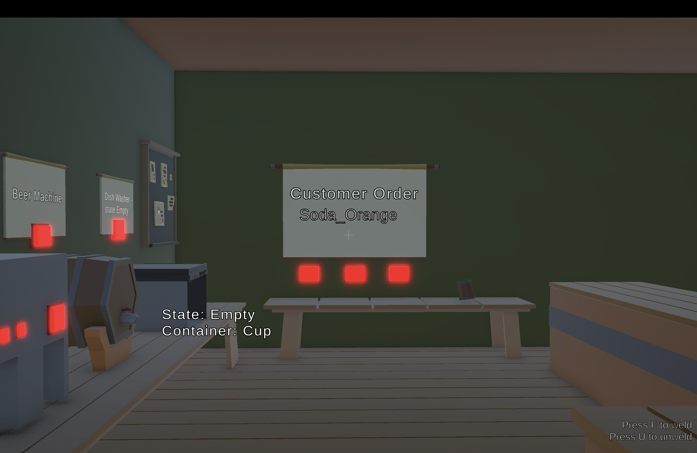
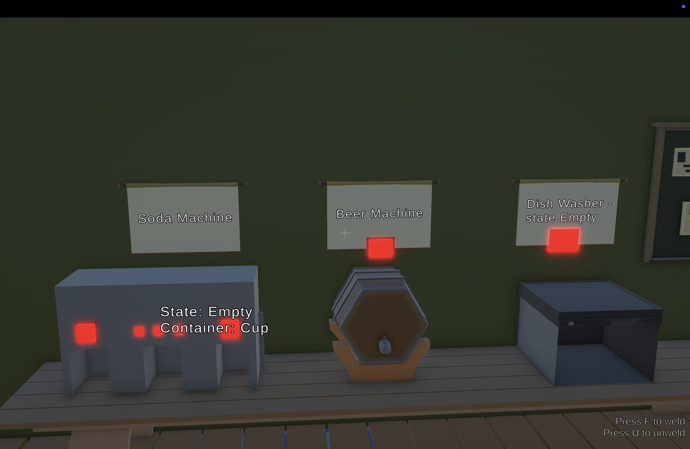

## SandBoxe

## Yago Phellipe Matos Lopes — 588542

## Project Documentation (Process + Sandbox Rationale)

### Project overview (what this is)
This project is a small **bar-themed sandbox prototype** built in **Unity 2022.3 LTS** with the **ACDH Sandbox Framework**. The goal is not a polished game, but a **technical prototype of interconnected systems** (physics + state + triggers + timed processes + feedback) that support **playful experimentation** and **emergent outcomes**.

The core loop is:
- The customer requests a drink on the order sign.
- The player chooses a container, prepares the correct drink using machines, and delivers it.
- The delivery zone validates the drink state, the customer reacts (happy/sad), the container is removed/reset, and a new request is generated.

---

### Design intention (player experience)
The intended player experience is **curiosity + controlled chaos**:
- The player is encouraged to **try combinations** (different containers, stations, drink variants).
- The world is physical and “toy-like”: objects are grabbed and moved, not selected from menus.
- Progress is readable through **clear visual states** and **sound cues**.
- Failure is not a dead-end: the wash station enables quick recovery and iteration.

---

## Player creative freedom + main goal (assignment requirement)

### Main goal (what the player is trying to do)
The main goal is to **fulfill drink orders**:
- Read the current request on the order sign.
- Prepare the correct drink in a chosen container.
- Deliver it to the customer’s delivery zone to trigger validation and feedback.

### Creative freedom (what the player is free to do)
The sandbox gives the player freedom in *how* to reach the goal:
- **Choose different containers** (Cup / Mug / Bottle) for the same order.
- **Physically manipulate** objects (grab, move, drop, misplace) rather than selecting from menus.
- **Experiment with station sequences** (e.g., attempt flavor before water, mix too early, deliver wrong drink).
- **Recover from mistakes** quickly using the wash station (reset to `Empty`).
- **Misuse machines** (pressing buttons without a valid container) and observe consequences (spills).

---

## How the sandbox is built (systems mindset)

### Key idea: “state is visible”
Instead of hidden variables, the most important object states are represented by **visible variants** (enabled/disabled child objects and materials). This makes the sandbox readable, teachable, and easy to playtest.

### Key idea: “systems are modular, not scripted sequences”
The experience is produced by modular building blocks:
- **Triggers** decide when actions are possible (socket gating, delivery validation).
- **Timers** create machine-like processing delays (water/flavor/mix, wash).
- **State machines** define what an object currently “is” (empty, beer, soda lemon, etc.).
- **Audio feedback** communicates process, success, and failure.

---

## Development process (how it evolved)

### Phase 1 — Establishing the core framework loop
1. Imported the ACDH Sandbox Framework and validated baseline functionality.
2. Copied the player/controller setup from a working example scene to ensure:
   - selection highlighting,
   - dragging/grabbing,
   - UI item description display,
   - and input routing
   worked identically in the custom scene.
3. Built a minimal bar environment with:
   - counter / table,
   - customer placement,
   - and space for stations.

**Outcome:** A stable interaction foundation: pick objects, move them, click on interactable parts, and see descriptions.

---

### Phase 2 — Building the central object: the container + visual states
The container is the “carrier” of drink state. The design requirement was: **no hidden state logic**, only **visible state changes**.

Steps:
1. Created the container as a root object with physics + interaction components.
2. Added child objects representing different drink states (visual variants).
3. Used the framework’s `StateMachine` to:
   - define named states (e.g., `Empty`, `Beer`, `Soda_Lemon`, etc.),
   - and toggle the correct visuals in each state via `OnStart` events.

**Outcome:** A single physical object with multiple visible states controlled by event-driven transitions.

---

### Phase 3 — Stations: gating + timed processes (machine feel)
Stations were designed as **physical interaction points** that:
- only allow correct actions at the correct time,
- and simulate “processing” with delay + sound.

Implementation pattern used repeatedly:
- A **Socket Trigger** detects when a container is placed.
- A **ConditionalTrigger** checks requirements (tag + state) and enables the correct button(s).
- A **TimerTrigger** drives a short process (start sound + set intermediate state + set final state).

This pattern was applied to:
- Beer machine (simple transform: Empty → Beer)
- Soda machine (multi-step transform: Water → Flavor → Mix, with 3 soda variants)
- Wash station (reset any prepared container back to Empty)

**Outcome:** Stations feel mechanical and readable, while remaining fully modular.

---

### Phase 4 — Expanding drink variety (3 soda flavors)
To satisfy “variations” and improve sandbox combinatorics, soda was expanded into three distinct outcomes:
- `Soda_Lemon`
- `Soda_Orange`
- `Soda_Passion`

The player selects flavor via distinct buttons. The final mix step produces the correct final state using the selected flavor.

**Outcome:** A single station supports multiple meaningful outputs via consistent rules (multi-step process + flavor choice).

---

### Phase 5 — Orders, delivery validation, and feedback (complete loop)
The delivery zone validates the container state against the current order. The system is:
- **event-driven** (no polling UI logic),
- **readable** (state names match the order text),
- and **recoverable** (wash station).

The customer has simple emotional feedback states:
- Neutral
- Happy (correct delivery)
- Sad (wrong delivery)

**Outcome:** End-to-end gameplay loop exists: request → prepare → validate → react → next request.

---

## Object categories and variations (sandbox requirement)

### Category 1 — Containers (3 variations)
Containers are different physical affordances that carry the same state logic:
- Cup
- Mug
- Bottle

They share the same state names, but are visually and physically distinct (shape/scale/material).

### Category 2 — Stations (3 variations)
Stations are interaction hubs:
- BeerMachine
- SodaMachine
- WashStation

Each station changes the container state via distinct rules and timing.

### Category 3 — Drinks (3+ variations)
Drink outcomes as final states:
- Beer
- Soda_Lemon
- Soda_Orange
- Soda_Passion

(This exceeds the minimum 3 variations.)

---

## How the sandbox creates emergent behavior
Although each rule is simple, the combination supports non-trivial play:
- The player can choose different containers for the same request.
- Multi-step soda creation invites experimentation and ordering mistakes (e.g., mixing too early).
- The wash station enables “try, fail, reset, retry” quickly.
- Physical manipulation can cause accidental outcomes (dropping, misplacing, mixing timing, grabbing the wrong item).

### Examples of unexpected combinations (assignment requirement)
Unexpected outcomes come from consistent rules interacting:
- **Wrong sequence**: pressing Flavor before Water does nothing useful (or causes a spill), teaching the process order through feedback.
- **Wrong delivery**: delivering the wrong state triggers customer sadness + failure sound, encouraging correction via wash + retry.
- **Container choice as a variable**: even if the drink state is correct, the player may pick different physical containers, which can change handling and accidents (dropping, missing the socket).
- **Machine misuse**: pressing a machine without a valid container produces a spill instead of progress, creating playful “oops” moments.

### Unpredictability (spills when a machine is used incorrectly)
To introduce a controlled form of unpredictability (without relying on random outcomes), machines can be “used wrong”:
- If the player presses a machine button **without a valid container placed in the socket**, the machine **spills liquid** instead of producing a drink.
- This triggers **immediate feedback** (spill particles + a wet puddle decal + spill audio), and the mess **cleans itself after a short delay** via a timer.

This creates playful moments (and small failures) that emerge naturally from player actions: the sandbox remains rule-consistent, but outcomes feel less scripted because misuse produces visible consequences.

The result is **consistent emergence**: unpredictable moments arise from stable rules, not random scripted events.

---

## Assets and visual approach
The visual approach is deliberately minimal and functional:
- Uses **free assets** where possible.
- Uses **simple primitives** (cubes/cylinders) during prototyping for fast iteration.
- Some props were assembled by hand in Unity (basic shapes + materials).

The main priority was always: **clarity of state** and **clarity of interaction**.

---

## In-game guidance (readability)
The prototype is designed to communicate “what to do” using:
- **Selectable descriptions** (short instructions when aiming at objects)
- **Order text** showing the current request
- **Audio cues** when machines run and when the customer reacts
- **Clear state visuals** on the container

---

## Player-facing story (short “storytelling” explanation)
You are working at a small experimental bar. A single customer stands at the counter and requests a drink. You pick a container, use the bar’s stations to produce the correct drink, and deliver it to the customer. The bar is intentionally more like a toy-box than a strict simulator: you can experiment, fail, wash, retry, and discover interactions through play.

---

## Where things are (interaction map)
This is the intended spatial layout and responsibilities:
- **BeerMachine**: produces `Beer` from `Empty`.
- **SodaMachine**: produces `Soda_Lemon`, `Soda_Orange`, or `Soda_Passion` through Water → Flavor → Mix steps.
- **WashStation**: resets the selected container back to `Empty`.
- **DeliveryZone**: validates the current order and triggers customer reactions.
- **Order sign (`OrderText`)**: displays the current request.

---

## Audio feedback (what sounds exist and why)
Audio is used as functional feedback:
- **Machine running sounds**: communicate that a timed process started and is progressing.
- **Success sound**: reinforces correct delivery.
- **Failure sound**: reinforces incorrect delivery.

This makes the sandbox readable even without heavy UI.

---

## Screenshots (2)
Screenshots are stored in `Assets/`:

#### 1) Overview of the bar layout (stations + customer + delivery)

#### 2) Order sign showing a request (e.g., Soda Passion)

---

## Technical notes (framework usage + small extensions)
Most logic is implemented using framework components, UnityEvents, trigger gating, and inspector configuration:
- `ConditionalTrigger` for validation and gating
- `TimerTrigger` for processing delays
- `StateMachine` for explicit object states
- `MouseListener` for button-like interactions

Two small helper scripts were added to keep the sandbox modular while scaling up:
- `CupRespawner`: manages selecting between container variants, respawning the selected one, and applying state changes to the currently selected container.

These extensions were used to preserve the “no hardcoded single object” limitation and to support multiple container variants cleanly.

---

## Playtests & iteration (how tests were executed and applied)
This prototype was iterated through short, informal playtests focused on clarity of goals, interaction flow, and state readability.

> **Assignment note**: the final submission should summarize results from **at least 10 people** and include **screenshots of what players did** (examples of play, failure, surprising moments).

### Playtest form link (Google Forms)
Paste your Google Forms link here:

- **Form link**: `https://forms.gle/P8kCTSW9Scyn8pfh9`

### Playtest method (how it was executed)
- **Format**: in-person or screen-shared session
- **Duration per tester**: ~5–10 minutes
- **Instruction**: minimal (players were first asked to try without explanation)
- **Data capture**: Google Forms questionnaire + brief notes taken during observation
- **What was measured**:
  - whether players understood the order/request,
  - whether the station layout and interactions were discoverable,
  - whether feedback (visual + audio) was enough to self-correct,
  - and which steps created friction (buttons, sockets, timing, delivery).

### Questionnaire (Google Forms)
The playtest questionnaire used a mix of multiple choice, Likert scales, and free-text:
- Player experience level with sandbox/physics games (multiple choice)
- Clarity of goal without explanation (1–5)
- Which actions they completed (checkbox list)
- Clarity of container visual states (1–5)
- Helpfulness of audio cues (1–5)
- Biggest confusion point (multiple choice)
- Friction points (checkboxes)
- “Sandbox feel” (1–5)
- Surprising/funny moment (short answer)
- One improvement suggestion (paragraph)

### Key feedback themes (what testers reported)
#### Theme 1 — “Everything looks like blocks, I can’t tell states apart”
Early versions used mostly primitive shapes (cubes/cylinders) with minimal differentiation. Multiple testers reported confusion such as:
- “I can’t tell if the drink is ready.”
- “Beer and soda look too similar.”
- “I’m not sure what changed after pressing a button.”

**Change applied**
- Increased visual contrast between states (different colors/materials).
- Added on-screen state HUD (state label) for clarity during testing.

#### Theme 2 — “Buttons don’t work unless I’m extremely close / aiming is unclear”
Some testers struggled to trigger button interactions consistently.

**Change applied**
- Increased clickable hitbox areas (larger colliders for buttons).
- Removed colliders that were blocking raycasts (machine colliders overlapping buttons).
- Kept interaction areas physically readable (buttons slightly protruding).

#### Theme 3 — “I didn’t understand why I failed delivery”
Players sometimes delivered the wrong drink and were unsure what went wrong.

**Change applied**
- Added clear success/failure audio feedback.
- Added customer emotion states (Happy/Sad) as immediate feedback.
- Ensured the order sign updates reliably and is always visible.

#### Theme 4 — “Multi-step soda is fun, but I want to know which step I’m on”
Players enjoyed the process, but wanted clearer step feedback.

**Change applied**
- Added timed process sounds for water/flavor/mix steps.
- Added explicit flavor variants (Lemon/Orange/Passion).
- Implemented a consistent “processing” state during timed steps.

### Summary of playtest feedback (Google Forms + observation)
Overall, testers reacted positively to the core idea once they understood the loop:
- **Positive**: “The concept was really clear” and the prototype has strong **audio feedback**.
- **Friction (onboarding)**: some players were initially confused about **where to find the current order**.
- **Friction (soda process)**: the **Water → Flavor → Mix** sequence was not always obvious without prior explanation.

**Changes applied / planned based on feedback**
- **Order sign readability**: increase contrast (background/color) so the order is noticeable immediately.
- **Soda clarity**: add a small step hint near the soda machine (e.g., “1) Water 2) Flavor 3) Mix”) to communicate the process visually.
- **Sandbox onboarding**: keep the discovery-based start, but ensure the main goal UI (order sign) is unmissable.

### Why playtests mattered (impact on the final build)
The final version became more sandbox-readable and less brittle because the feedback forced improvements in:
- **state legibility** (visual differentiation and explicit state display),
- **interaction reliability** (colliders/raycast blocking fixes),
- **feedback loop** (audio + customer reactions),
- and **iterability** (wash station enabling fast recovery).

---

## itch.io Link
**Game link (itch.io)**: (paste link)

