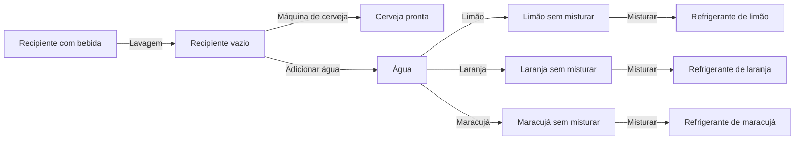

# Bar Sandbox

Um pequeno bar onde preparar a bebida certa é o objetivo, e experimentar faz parte da diversão.

Desenvolvi este projeto para a disciplina de **Game Systems, na Saxion University**, como uma proposta de jogo sandbox. Minha ideia era colocar o jogador atrás de um balcão: um cliente pede uma bebida, e cabe ao jogador escolher um recipiente, usar as máquinas e entregar o pedido.

Queria explorar como regras simples poderiam funcionar juntas: pegar objetos, preparar bebidas em etapas, escolher sabores, cometer erros e tentar novamente. O resultado é um protótipo acadêmico em que **física, máquinas de estado e feedback visual e sonoro** dão forma à experiência de trabalhar nesse bar experimental.

**[Jogar no itch.io](https://yagophellipe.itch.io/sandbox-bar-game)**

## Conheça o bar

O cenário reúne as estações de preparo e lavagem ao redor do balcão. É nesse espaço que o jogador movimenta os recipientes e experimenta as combinações de bebidas.

*Da esquerda para a direita: máquina de refrigerante, máquina de cerveja e estação de lavagem.*

O painel apresenta o pedido atual do cliente, enquanto o indicador na tela mostra o recipiente selecionado e seu estado durante o preparo.

*Um pedido de refrigerante de laranja (`Soda_Orange`), com o copo ainda vazio (`Empty`).*

## A experiência do jogador

O ciclo de jogo começa no painel de pedidos e termina na reação do cliente:

1. **Leia o pedido** para descobrir qual bebida preparar.
2. **Escolha um recipiente:** copo, caneca ou garrafa.
3. **Leve o recipiente até uma estação** e use os botões para preparar a bebida.
4. **Entregue ao cliente.** A área de entrega verifica se a bebida corresponde ao pedido e aciona uma reação de satisfação ou insatisfação.
5. **Continue experimentando.** Use a estação de lavagem para esvaziar o recipiente e recomeçar o preparo quando necessário.

O jogador manipula objetos diretamente no cenário. Posicionar o recipiente, observar o que mudou e acompanhar o preparo fazem parte da interação. As descrições dos objetos, o painel de pedidos e o indicador de estado na tela ajudam a entender o que está acontecendo.

## O que torna o bar um sandbox?

O pedido dá uma direção ao jogador, mas há espaço para explorar os sistemas: usar recipientes diferentes, testar a ordem dos botões, entregar uma bebida incorreta ou lavar o recipiente para tentar outra combinação.

A liberdade vem da interação entre três grupos de elementos:

| Elementos | Variações | Papel na experiência |
| --- | --- | --- |
| Recipientes | Copo, caneca e garrafa | Carregam a bebida e oferecem formas diferentes de manipular o objeto. |
| Estações | Máquina de cerveja, máquina de refrigerante e lavagem | Transformam o conteúdo do recipiente com regras e tempos próprios. |
| Bebidas | Cerveja e refrigerantes de limão, laranja e maracujá | São os resultados que o jogador prepara para atender aos pedidos. |

Essas combinações também permitem pequenos acidentes. Acionar uma máquina sem um recipiente válido pode provocar um derramamento, com partículas, uma marca de líquido e som. Um temporizador limpa o efeito depois de um intervalo. Errar a sequência de preparo ou posicionar mal um objeto passa a ter uma consequência perceptível.

A intenção era criar **curiosidade e um pouco de caos**: o jogador aprende as regras observando as consequências de suas ações, e a lavagem permite recuperar-se dos erros rapidamente.

## As estações do bar

### Cerveja

A máquina de cerveja oferece o preparo mais direto: receber um recipiente vazio e enchê-lo. Ela apresenta a relação básica entre posicionar um objeto, acionar uma máquina e esperar pelo resultado.

### Refrigerante

O refrigerante exige uma sequência: **água → escolha do sabor → mistura**. O jogador escolhe limão, laranja ou maracujá, e o recipiente passa por estados intermediários antes de a bebida ficar pronta.

Esse processo foi pensado para tornar o preparo mais interessante: escolher um sabor faz parte da receita, mas ainda é preciso concluir a mistura antes da entrega.

### Lavagem

A estação de lavagem retorna o recipiente ao estado vazio. Ela fecha o ciclo de experimentação: preparar, observar, lavar e tentar de novo, sem precisar reiniciar a cena.

## Como funcionam os estados

Uma ideia central do projeto é que **o estado precisa ser visível**. O recipiente continua sendo o mesmo objeto físico, enquanto seu conteúdo muda. Objetos visuais filhos e materiais representam essas mudanças, e o HUD informa o estado atual e o recipiente selecionado.

### Estados da bebida

| Estado | Significado |
| --- | --- |
| `Empty` | Recipiente vazio, pronto para começar um preparo. |
| `Beer` | Cerveja pronta. |
| `Soda_Filling` | Estado intermediário usado durante o processamento do refrigerante. |
| `Soda_Water` | Base de água preparada para receber o sabor. |
| `Soda_Lemon_Unmixed` / `Soda_Orange_Unmixed` / `Soda_Passion_Unmixed` | Sabor adicionado, ainda aguardando mistura. |
| `Soda_Lemon` / `Soda_Orange` / `Soda_Passion` | Refrigerante finalizado no sabor escolhido. |

O fluxo abaixo resume as etapas principais do preparo; os temporizadores controlam as transições intermediárias:

Os prefabs também preservam estados como `Soda`, `Juice`, `Soda_Flavor` e `Soda_Mix`. Os pedidos do bar se concentram em cerveja e nos três sabores de refrigerante descritos acima.

### Estados do cliente e validação da entrega

O cliente possui três estados: `Neutral`, `Happy` e `Sad`. A área de entrega compara o estado da bebida com o pedido atual. Uma entrega correta aciona a reação positiva e o som de sucesso; uma incorreta aciona a reação negativa e o som de falha. A remoção ou reposição do recipiente e a geração de um novo pedido completam o ciclo de atendimento.

### Como os sistemas se conectam

A maior parte da lógica foi montada no Inspector da Unity com componentes do **ACDH Sandbox Framework** e eventos que conectam uma ação à seguinte:

| Componente | Uso no bar |
| --- | --- |
| `StateMachine` | Define o estado atual e executa eventos ao entrar ou sair dele, incluindo mudanças visuais. |
| `ConditionalTrigger` | Verifica condições, como o estado de uma bebida na área de entrega. |
| `TimerTrigger` | Controla os intervalos de preparo, lavagem e efeitos temporários. |
| `MouseListener` | Conecta o clique nos botões às ações das máquinas. |
| `RandomTrigger` | Permite sortear o próximo pedido. |

O projeto também conta com três scripts de apoio:

- **[CupRespawner](Assets/CupRespawner.cs):** seleciona entre os recipientes, reposiciona o selecionado e aplica estados e sabores ao objeto atual.
- **[SocketButtonRouter](Assets/SocketButtonRouter.cs):** verifica a presença e o estado do recipiente no encaixe da máquina. Ao pressionar o botão, inicia o processo válido ou aciona o derramamento.
- **[StateHUD](Assets/StateHUD.cs):** mostra na tela o recipiente selecionado e seu estado, ajudando o jogador a acompanhar o preparo.

Essa organização permite que recipientes e estações compartilhem regras, sem depender de um único copo fixo para toda a experiência.

## Processo de desenvolvimento

O desenvolvimento começou pela base de interação do framework: seleção, destaque dos objetos, arrasto e descrições. A partir de uma cena de exemplo, montei o espaço do bar com balcão, cliente e áreas para as estações.

Em seguida, construí o recipiente como o centro do sistema, combinando física e variações visuais para representar seu conteúdo. Com essa base funcionando, adicionei as estações e seus processos temporizados. A máquina de refrigerante foi expandida para três sabores, mantendo a mesma sequência de preparo.

Por fim, conectei os pedidos, a validação da entrega e as reações do cliente para completar o ciclo de jogo. O cenário combina assets gratuitos, formas simples e objetos montados na Unity, priorizando a clareza das interações durante a prototipagem.

## Playtests e aprendizados

A documentação registra sessões informais de aproximadamente 5 a 10 minutos, presenciais ou com compartilhamento de tela. Os jogadores começavam com pouca explicação, para observar se conseguiam descobrir o objetivo e usar as estações. As observações foram acompanhadas por um [questionário de playtest](https://forms.gle/P8kCTSW9Scyn8pfh9).

O questionário abordava experiência com jogos sandbox, compreensão do objetivo, ações concluídas, clareza dos estados, utilidade dos sons, dificuldades de interação e sugestões. Os principais aprendizados foram:

| Dificuldade observada | Mudança registrada no desenvolvimento |
| --- | --- |
| Não perceber se a bebida estava pronta ou o que havia mudado. | Maior contraste entre os estados e inclusão do HUD com o estado atual. |
| Dificuldade para acertar os botões. | Ampliação das áreas clicáveis e remoção de colliders que bloqueavam os cliques. |
| Não entender por que uma entrega falhou. | Sons de sucesso e falha, acompanhados das reações do cliente. |
| Perder-se nas etapas do refrigerante. | Sons durante o preparo e estados que tornam as etapas mais perceptíveis. |

O retorno destacou a ideia do bar e o feedback sonoro, mas também mostrou que encontrar o pedido e compreender a sequência **água → sabor → mistura** exigiam mais orientação. A documentação aponta maior contraste no painel e uma indicação das etapas junto à máquina como melhorias a aplicar ou refinar.

O principal aprendizado foi que criar regras funcionais é apenas parte do trabalho: o jogador precisa conseguir perceber essas regras enquanto joga.

## Abrir o projeto

1. Adicione esta pasta como projeto no Unity Hub.
2. Use **Unity 6000.2.6f2**, a versão registrada em `ProjectSettings/ProjectVersion.txt`.
3. Abra a cena [`Assets/Scenes/BarSandbox.unity`](Assets/Scenes/BarSandbox.unity).
4. Entre em **Play Mode**.

A documentação original menciona Unity 2022.3 LTS; a versão acima corresponde à configuração atual deste repositório.

## Autoria e contexto

**Yago Phellipe Matos Lopes** — projeto acadêmico de **Game Systems, Saxion University**.

O Bar Sandbox foi construído sobre o **ACDH Sandbox Framework**, utilizado como base para as interações e os componentes de sistemas. O conceito do bar, a montagem das estações, a configuração do preparo e dos pedidos e os scripts de apoio compõem o trabalho desenvolvido para este projeto.

Para consultar o registro mais detalhado do processo, veja a [documentação de desenvolvimento](PROCESS_DOCUMENTATION.md).
